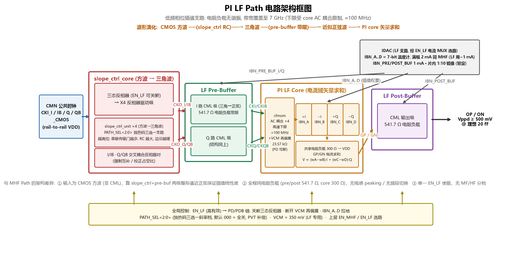

# PI LF Path 功能描述

依据 5 张原理图（顶层 / slope_ctrl_core / slope_ctrl_unit / pre-buffer+post-buffer / PI LF core）
及设计者确认参数整理。配套框图：`pi_lf_architecture.png`（脚本 `draw_pi_lf_architecture.py`）。



## 1. 定位与指标

- RX 时钟路径的**低频相位插值支路**，与 MHF path 二选一工作（上层 EN_MHF / EN_LF
  严格互斥选路，IDAC 电流 MUX 同步切换偏置去向）。
- 频率覆盖：上限 7 GHz；下限受 PI core 输入 AC 耦合限制，约 **100 MHz**。
  单一频段连续覆盖，无 MHF 的 MF/HF 分档。
- 输入：CMN 公共时钟四相 `CKI_I / IB / Q / QB`，**CMOS rail-to-rail 方波**
  （区别于 MHF 的 CML 输入）。
- 输出：`OP / ON` 差分插值时钟，Vppd ≥ 500 mV @ 理想 20 fF 负载。
- 共模基准 VCM = **350 mV**（LF 专用；MHF 侧为 450 mV 标称）；全程**纯电阻负载**
  （pre/post 541.7 Ω，core 300 Ω），无电感 peaking、无谐振调谐。

## 2. 工作原理：三段式波形演化

相位插值的线性度要求参与矢量求和的 I/Q 波形接近正弦：只有正弦基向量的加权和，
其过零点才随权重近似线性移动。MHF 靠 LC 谐振负载天然得到正弦边沿；LF 频段低，
电感谐振不现实，改用两级整形逼近：

```
CMOS 方波 ──(slope_ctrl 传输门 RC 充放电)──▶ 三角波(边沿≈线性斜坡)
        ──(pre-buffer 541.7Ω CML 带限)──▶ 近似正弦波
        ──(PI core 四相加权电流求和)──▶ 过零点随权重线性移动 = 线性插值
```

谐波角度：方波奇次谐波按 1/n 衰减，RC 整形成三角波后按 1/n² 衰减
（3 次谐波从约 −9.5 dB 降到约 −19 dB），pre-buffer 的单极点滚降再压一级，
到 PI core 输入已足够接近正弦。

## 3. 逐级功能

### 3.1 slope_ctrl_core（方波 → 三角波）

- 输入级三态反相器（EN_LF 可整体关断）+ X4 反相器驱动级。
- **slope_ctrl_unit ×4**（I/IB/Q/QB 各一）：单元内 3 条传输门支路，各支路串联的
  传输门（`gate_ulvt_x2_pn53`）级数不同。`PATH_SEL<2:0>` 为**独热码三选一**：
  越高位支路串联传输门越多 → 串联电阻越大 → RC 充放电越久 → 边沿越缓。
  默认 `000` 全关（通路关闭）。用途：PVT 下把边沿斜率修到目标值。
- I/IB、Q/QB 间交叉耦合反相器对：强制互补、校正占空比。

### 3.2 LF pre-buffer（三角 → 正弦）

- I、Q 各一级 CML 差分级，541.7 Ω 电阻负载。
- 有限带宽对三角波残余高次谐波滤波，输出近正弦；同时完成 CMOS→CML 电平域转换。
- 尾电流 `IBN_PRE_BUF_I/Q` 由 IDAC 提供（暂定 1 mA，片内 1:10 镜像为暂定说法）。

### 3.3 PI LF core（矢量求和，图5）

- **输入接口**：四路时钟经 `cfmom` MOM 电容 AC 耦合（高通下限 ≈100 MHz）进入
  内部节点 `CKI_/CKIB_/CKQ_/CKQB_`；VCM 经传输门到 `VCM_A/VCM_C`，再经
  2×23.57 kΩ 电阻为内部节点重建直流共模。
- **四个 cml_unit_core**（极性由输入交换实现）：

  | 单元 | 输入 (IN, IP) | 基向量 | 权重 |
  |---|---|---|---|
  | I0 | CKIB_, CKI_ | +I | IBN_A |
  | I1 | CKI_, CKIB_ | −I | IBN_B |
  | I2 | CKQB_, CKQ_ | +Q | IBN_C |
  | I3 | CKQ_, CKQB_ | −Q | IBN_D |

- **权重来源**：IDAC 的 PI 7-bit 温度计阵列（TA..TD<126:0>，127 个开关电流单元）
  经 EN_LF 电流 MUX 送出 → `IBN_A..D` 尾流偏置。象限 = 哪两个相邻基向量拿到
  非零权重；象限内相位步进 = 温度计码在两基向量间重分配电流。
- **求和输出**：四单元漏极并联于共享 **300 Ω** 负载（上拉 VDD），
  差分求和节点 `GP/GN`：`V(GP,GN) ∝ (wA−wB)·I(t) + (wC−wD)·Q(t)`。
- **下电**：EN_LF=0 → PD/PDB 链 → 传输门断开 VCM 再偏置，`nch_ulvt_mac` 把
  `VCM_A/VCM_C` 与 `IBN_A..D` 全部拉地，插值电流关断。

### 3.4 LF post-buffer

- CML 输出级，541.7 Ω 电阻负载，驱动 `OP/ON`；尾流 `IBN_POST_BUF`。
- 输出摆幅核算：300 Ω core 负载 × mA 级插值总电流 → 数百 mV 单端摆幅，
  经 post-buffer 满足 ≥500 mVppd @ 20 fF；300 Ω × ~20 fF 极点 >20 GHz，
  7 GHz 上限无带宽压力，与"无需电感 peaking"的选择自洽。

## 4. 偏置与控制汇总

| 信号 | 功能 |
|---|---|
| EN_LF | 高有效总使能；=0 时关三态反相器、断 VCM 再偏置、IBN_A..D 拉地 |
| PATH_SEL<2:0> | 独热码三选一斜率档，默认 000 全关，PVT 补偿 |
| VCM | 350 mV 共模基准（LF 专用取值） |
| IBN_A..D | PI 7-bit 温度计 IDAC ×4，经 EN_LF 电流 MUX（插值权重） |
| IBN_PRE_BUF_I/Q, IBN_POST_BUF | buffer 尾流偏置（暂定 1 mA / 1:10 镜像暂定） |

## 5. 与 MHF path 对比

| 项 | MHF path | LF path |
|---|---|---|
| 频段 | MF 14 GHz / HF 28 GHz 双档 | ≈100 MHz – 7 GHz 连续 |
| 输入 | CML（暂定 400 mVppd） | CMOS rail-to-rail 方波 |
| 正弦化手段 | LC 谐振负载（电感多抽头调谐） | slope_ctrl RC + pre-buffer 带限两级整形 |
| 负载 | 多抽头电感 peaking | 纯电阻 541.7 / 300 / 541.7 Ω |
| 频段/使能控制 | ENB_MF / ENB_HF 互斥 | 单一 EN_LF |
| 插值权重 | IDAC 7-bit 温度计 ×4（共用一套） | 同左，经电流 MUX 二选一送达 |

## 6. 电路特点（难点与重点优化项）

1. **正弦化是全支路的核心难点**：插值线性度要求 I/Q 基向量近正弦，但 LF 频段
   （低至 ~100 MHz）无法像 MHF 那样用 LC 谐振取正弦——所需电感值/面积/Q 不现实。
   解法是"两级逼近"：slope_ctrl 传输门 RC 把方波整成三角波（奇次谐波从 1/n 变
   1/n² 衰减），pre-buffer 带限再滤一级。输入波形正弦度直接决定相位步进 DNL/INL，
   是本支路花精力最多的地方。
2. **≈70× 频率范围单档连续覆盖**（0.1–7 GHz）：固定 RC 无法对所有频率都给出
   "满摆幅三角波"——频率过低时三角波提前到顶退化为梯形（趋方波，插值线性度劣化），
   频率过高时充放电不满幅度塌缩。PATH_SEL<2:0> 独热三档 RC 修调即为此设计，
   兼顾 PVT 下的斜率漂移补偿。
3. **AC 耦合下限与面积的折中**：core 输入 cfmom + 23.57 kΩ 再偏置构成
   ≈100 MHz 高通，决定频段下限；更低下限需要成倍的电容/电阻面积。
4. **占空比与互补性**：CMOS 单端方波链易累积占空比误差，且占空比误差直接映射为
   插值相位误差 → I/IB、Q/QB 间交叉耦合反相器对强制互补、校正占空比。
5. **电平域衔接**：CMOS rail-to-rail → CML 的共模转换靠 AC 耦合 + VCM(350 mV)
   再偏置完成；差分对偏置点与 300 Ω 负载摆幅（GP/GN 共模 = VDD − w·I·R）联合设计。
6. **无电感纯电阻负载**：300 Ω × ~20 fF 级寄生的极点在 20 GHz 以上，7 GHz 上限
   无带宽压力；相对 MHF 省去电感面积与抽头调谐，是 LF 支路的结构简化收益。
7. **权重电流与 MHF 复用**：共用同一套 PI 7-bit 温度计 IDAC，经 EN_MHF/EN_LF
   电流 MUX 切换去向，保证两支路相位码口径一致并省一套 DAC。

## 7. DFX 设计

### 7.1 状态控制考虑与设计

- **关断 (en)**：EN_LF 寄存器位，高有效。=0 时经 PD/PDB 反相器链三路同时动作：
  ① 关断 slope_ctrl 输入三态反相器（截断信号）；② 传输门断开 VCM 再偏置；
  ③ `nch_ulvt_mac` 把 VCM_A/VCM_C 与 IBN_A..D 全部拉地 → 全支路零静态电流。
- **支路冗余/旁路 (bypass)**：EN_MHF / EN_LF 严格互斥二选一（可同时为 0 全关）；
  LF 与 MHF 互为备份路径，等效支路级旁路能力。IDAC 侧另有全局 PD/PDB
  （VBP 拉 VDD 关断全部镜像单元）。
- **复位 (rstb)**：模拟通路无内部记忆状态，无需独立复位；上电顺序无记忆效应。

### 7.2 可选考虑与设计（高风险点的寄存器可配性）

- **RC 斜率漂移**（本支路最高风险点，PVT/频率双重敏感）→ PATH_SEL<2:0>
  独热码三档斜率可配。
- **摆幅/带宽风险** → IDAC 3-bit 粗调 ICTRL_PI / ICTRL_PRE_BUF /
  ICTRL_POST_BUF<2:0>，各级尾流寄存器可配。
- **相位控制**：7-bit 温度计权重（TA..TD<126:0>）由相位控制字寄存器动态译码；
  ±I/±Q 四象限结构天然覆盖 360°，等效"极性可选"。
- 原理图未见：pre/post buffer 独立使能、可配延迟单元（如需支路外相位微调可评估补充）。

### 7.3 可测性考虑与设计

原理图中未见专用测试引出，以下为低成本候选测试点（供评审）：

- **直流测试点**：
  - `VCM_A / VCM_C`：高阻节点（23.57 kΩ 之后），可验证 350 mV 偏置建立与
    PD 拉地行为，引出成本低；
  - `IBN_A..D`：验证 IDAC→电流 MUX 权重偏置到位及下电拉地；
  - `GP/GN 输出共模`（= VDD − ΣI·R/2）：直流读数即可判断尾流与负载通路完整性。
- **时钟测试点**：`OP/ON`（post-buffer 后）经分频器引出，观测插值时钟
  存在性/频率；slope_ctrl 三角波节点带宽敏感不宜直接引出，靠直流点 +
  相位码功能扫描间接定位。
- **相位步进可测性**：扫相位控制字、测 OP/ON 相对参考时钟的延迟，得插值
  DNL/INL，覆盖"正弦度不足→线性度劣化"这一主要失效模式。

## 8. 电路符号与端口说明

### 8.1 电路符号

- 符号主体为 **I/Q 相位平面矢量插值图示**：水平/垂直细箭头为 ±I/±Q 四个基向量，
  斜向粗箭头为温度计权重合成的插值矢量，外圈旋转箭头示意相位码扫描时输出相位
  在 360° 内连续旋转；`LF` 字标标识低频插值支路。
- 端口布局：左侧自上而下为控制（EN_LF、PATH_SEL<2:0>）、四相 CMOS 时钟输入、
  基准与偏置（VCM、IBN×7）；右侧 OP/ON 差分输出；顶部 VDD/VSS 电源对。
- `[@libName] / [@instanceName] / [@partName]` 为 CAD 例化占位符。

### 8.2 端口说明

| 序号 | 端口名 | 位宽 | 方向 | 属性 | 默认值 | 电源域 | 功能描述 |
|---|---|---|---|---|---|---|---|
| 1 | VDD | 1 | IO | 电源地 | 750m | VDD | LF 支路电源（单一 750 mV 域） |
| 2 | VSS | 1 | IO | 电源地 | 0 | VDD | 地 |
| 3 | EN_LF | 1 | I | 寄存器 | 0 | VDD | 高有效总使能；=0 时三态反相器关断输入、断开 VCM 再偏置、IBN_A..D 拉地，全支路零静态电流；与 EN_MHF 严格互斥 |
| 4 | PATH_SEL<2:0> | 3 | I | 寄存器 | 3'b000 | VDD | slope_ctrl 斜率档独热码（三选一）；000=全关；越高位串联传输门越多→RC 越大→边沿越缓；PVT/频率补偿 |
| 5 | CKI_I_CMOS | 1 | I | 数字(时钟) | — | VDD | CMN 公共时钟 I 相（0°），CMOS rail-to-rail 方波，7 GHz |
| 6 | CKI_IB_CMOS | 1 | I | 数字(时钟) | — | VDD | 同上，IB 相（180°） |
| 7 | CKI_Q_CMOS | 1 | I | 数字(时钟) | — | VDD | 同上，Q 相（90°） |
| 8 | CKI_QB_CMOS | 1 | I | 数字(时钟) | — | VDD | 同上，QB 相（270°） |
| 9 | VCM | 1 | I | 参考源 | 350m | VDD | PI core AC 耦合后共模再偏置基准；片内经传输门 + 2×23.57 kΩ 高阻注入，负载极轻 |
| 10 | IBN_A | 1 | I | 参考源(偏置电流) | 2m 满幅 | VDD | +I 单元插值权重电流；与 MHF 复用 IDAC（增加选通开关），满幅同 MHF 为 2 mA，LF 典型仅用至 ~1 mA；片内 1:10 镜像（暂定）为核内同名 IBN_A 尾流 |
| 11 | IBN_B | 1 | I | 参考源(偏置电流) | 2m 满幅 | VDD | −I 单元插值权重（同上） |
| 12 | IBN_C | 1 | I | 参考源(偏置电流) | 2m 满幅 | VDD | +Q 单元插值权重（同上） |
| 13 | IBN_D | 1 | I | 参考源(偏置电流) | 2m 满幅 | VDD | −Q 单元插值权重（同上） |
| 14 | IBN_PRE_BUF_I | 1 | I | 参考源(偏置电流) | 1m | VDD | pre-buffer I 路 CML 尾流偏置 |
| 15 | IBN_PRE_BUF_Q | 1 | I | 参考源(偏置电流) | 1m | VDD | pre-buffer Q 路 CML 尾流偏置 |
| 16 | IBN_POST_BUF | 1 | I | 参考源(偏置电流) | 1m | VDD | post-buffer CML 尾流偏置 |
| 17 | OP | 1 | O | 模拟(时钟) | — | VDD | 差分插值时钟正端；OP/ON 合计 Vppd ≥ 500 mV @ 理想 20 fF |
| 18 | ON | 1 | O | 模拟(时钟) | — | VDD | 差分插值时钟负端 |

（属性栏词汇沿用模板：电源地 / 寄存器 / 数字 / 参考源 / 模拟；全部端口位于单一
750 mV VDD 电源域；EN_LF 复位默认 0 = 支路关断；图5 核内权重引脚与顶层端口同名
IBN_A..D，设计者已确认。）

## 9. 暂定与遗留项

- "片内 1:10 镜像为尾电流"为暂定说法，待偏置细节图确认。
- IBN_A..D 满幅 2 mA 为 IDAC 与 MHF 复用（增加选通开关）的口径，LF 典型仅用至 ~1 mA。
- LF 无独立相位码译码图（BIN2PI/Gray→温度计链与 MHF 共用，见 IDAC 框图章节）。

---
*2026-09-30 整理；core 负载 300 Ω、PATH_SEL 独热码、AC 耦合下限 100 MHz、
权重=IDAC 温度计电流、VCM=350 mV（LF 专用）、电源域单一 VDD 750 mV、EN_LF 复位默认 0、
IBN_A..D 满幅 2 mA（LF 用 ~1 mA）、核内权重引脚名 IBN_A..D（非 BNL，读图勘误）
均为设计者当面确认口径。*
