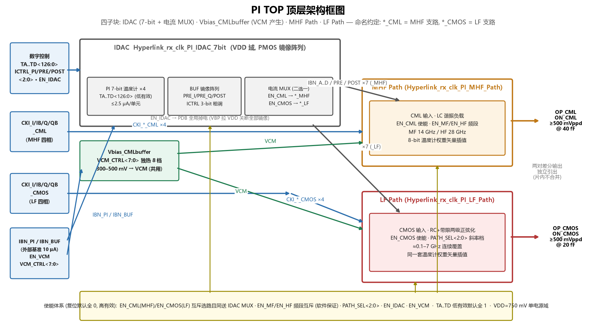

# PI TOP 顶层：电路符号与端口说明

依据 PI TOP 顶层原理图（IDAC / Vbias_CMLbuffer / MHF Path / LF Path 四子块）与
顶层 symbol 整理。配套框图：`pi_top_architecture.png`
（脚本 `draw_pi_top_architecture.py`）；子块详见
`pi_mhf_architecture.png`、`pi_lf_architecture.png`、`idac_architecture.png`、
`pi_lf_functional_description.md`。

## 1. 电路符号

- 符号主体与两条支路一致：**I/Q 相位平面矢量插值图示**（±I/±Q 基向量 + 插值
  合成矢量 + 360° 旋转箭头），代表顶层对外的统一功能——按相位码在四象限内
  插值输出时钟。
- 端口布局：左侧自上而下按功能分组——支路使能与斜率码（EN_CMOS、
  PATH_SEL<2:0>、EN_CML）→ 两组四相时钟（CMOS 组 / CML 组）→ MHF 频段
  （EN_HF、EN_MF）→ IDAC 控制（EN_IDAC、IBN_PI、IBN_BUF、ICTRL×3）→
  温度计权重码（TA..TD<126:0>）→ VCM 产生（EN_VCM、VCM_CTRL<7:0>）；
  右侧两对差分输出（OP/ON_CML、OP/ON_CMOS）；顶部 VDD/VSS。
- `[@libName]/[@instanceName]/[@partName]` 为 CAD 例化占位符。

## 2. 顶层互连要点（读图）

- **命名约定**：`*_CML` = MHF 支路（CML 输入时钟、LC 谐振），`*_CMOS` = LF
  支路（CMOS 输入时钟、RC+带限正弦化）。
- **IDAC** 接收 TA..TD<126:0>/ICTRL×3/EN_IDAC/IBN_PI/IBN_BUF，内部电流 MUX 由
  EN_CML/EN_CMOS 决定 14 路输出电流（IBN_A..D、IBN_PRE_BUF_I/Q、IBN_POST_BUF
  各带 `_MHF`/`_LF` 后缀）送哪条支路。
- **Vbias_CMLbuffer**：EN_VCM 使能，VCM_CTRL<7:0>（**8-bit 独热码，8 档**）设定
  输出 VOUT → 网络 VCM，量程约 300–500 mV（档距 ≈28.6 mV），**MHF 与 LF 共用
  一路**，按当前启用支路重配（LF 350 mV / MHF 450 mV，设计者确认）。
- **输出不合并**：OP/ON_CML 与 OP/ON_CMOS 两对独立引出，上层负责后续选择。

## 3. 端口说明

| 序号 | 端口名 | 位宽 | 方向 | 属性 | 默认值 | 电源域 | 功能描述 |
|---|---|---|---|---|---|---|---|
| 1 | VDD | 1 | IO | 电源地 | 750m | VDD | PI 顶层电源（单一 750 mV 域，已确认） |
| 2 | VSS | 1 | IO | 电源地 | 0 | VDD | 地 |
| 3 | EN_CMOS | 1 | I | 寄存器 | 0 | VDD | LF 支路使能（接 LF 的 EN_LF），同送 IDAC 电流 MUX 选通 `*_LF`；与 EN_CML 互斥（上层软件保证），可同 0 全关 |
| 4 | PATH_SEL<2:0> | 3 | I | 寄存器 | 3'b000 | VDD | LF slope_ctrl 斜率档独热码三选一；000=全关；越高位 RC 越大边沿越缓 |
| 5 | EN_CML | 1 | I | 寄存器 | 0 | VDD | MHF 支路使能（接 MHF 的 PDB），同送 IDAC 电流 MUX 选通 `*_MHF`；与 EN_CMOS 互斥（上层软件保证） |
| 6 | CKI_I_CMOS | 1 | I | 数字(时钟) | — | VDD | LF 四相时钟 I 相(0°)，CMOS rail-to-rail 方波，7 GHz |
| 7 | CKI_IB_CMOS | 1 | I | 数字(时钟) | — | VDD | 同上，IB 相(180°) |
| 8 | CKI_Q_CMOS | 1 | I | 数字(时钟) | — | VDD | 同上，Q 相(90°) |
| 9 | CKI_QB_CMOS | 1 | I | 数字(时钟) | — | VDD | 同上，QB 相(270°) |
| 10 | CKI_I_CML | 1 | I | 模拟(时钟) | — | VDD | MHF 四相时钟 I 相(0°)，CML（暂定 400 mVppd），MF 14 G / HF 28 GHz |
| 11 | CKI_IB_CML | 1 | I | 模拟(时钟) | — | VDD | 同上，IB 相(180°) |
| 12 | CKI_Q_CML | 1 | I | 模拟(时钟) | — | VDD | 同上，Q 相(90°) |
| 13 | CKI_QB_CML | 1 | I | 模拟(时钟) | — | VDD | 同上，QB 相(270°) |
| 14 | EN_HF | 1 | I | 寄存器 | 0 | VDD | MHF HF 档使能（28 GHz），顶层高有效；与 EN_MF 互斥由上层软件保证 |
| 15 | EN_MF | 1 | I | 寄存器 | 0 | VDD | MHF MF 档使能（14 GHz），顶层高有效；与 EN_HF 互斥由上层软件保证 |
| 16 | EN_IDAC | 1 | I | 寄存器 | 0 | VDD | IDAC 全局使能（接内部 PDB）；=0 时 VBP 拉 VDD 关断全部镜像单元 |
| 17 | IBN_PI | 1 | I | 参考源(偏置电流) | 10u | VDD | PI 权重阵列外部基准电流（10 μA，已确认） |
| 18 | IBN_BUF | 1 | I | 参考源(偏置电流) | 10u | VDD | PRE/POST buffer 阵列外部基准电流（10 μA，已确认） |
| 19 | ICTRL_PI<2:0> | 3 | I | 寄存器 | 3'b000 | VDD | PI 单元电流 3-bit 粗调（固定 3μ + {1,2,4}μ 加权；000=仅固定档） |
| 20 | ICTRL_PRE_BUF<2:0> | 3 | I | 寄存器 | 3'b000 | VDD | pre-buffer 电流 3-bit 粗调（固定 30μ + {10,20,40}μ；000=仅固定档） |
| 21 | ICTRL_POST_BUF<2:0> | 3 | I | 寄存器 | 3'b000 | VDD | post-buffer 电流 3-bit 粗调（同上结构） |
| 22 | TA<126:0> | 127 | I | 数字 | 全 1 | VDD | I 相温度计权重码，低有效（默认全 1 = 全关）；由相位控制字动态译码 |
| 23 | TB<126:0> | 127 | I | 数字 | 全 1 | VDD | IB 相温度计权重码（同上） |
| 24 | TC<126:0> | 127 | I | 数字 | 全 1 | VDD | Q 相温度计权重码（同上） |
| 25 | TD<126:0> | 127 | I | 数字 | 全 1 | VDD | QB 相温度计权重码（同上） |
| 26 | EN_VCM | 1 | I | 寄存器 | 0 | VDD | Vbias_CMLbuffer 使能，产生 MHF/LF 共用 VCM |
| 27 | VCM_CTRL<7:0> | 8 | I | 寄存器 | 按支路选档 | VDD | VCM 电压调节，**8-bit 独热码 8 档**，量程约 300–500 mV（档距 ≈28.6 mV）；LF 配 350 mV 档、MHF 配 450 mV 档，按当前启用支路重配同一路输出 |
| 28 | OP_CML | 1 | O | 模拟(时钟) | — | VDD | MHF 差分插值时钟正端；swing ≥ 500 mVppd @ 40 fF 电容负载 |
| 29 | ON_CML | 1 | O | 模拟(时钟) | — | VDD | MHF 差分插值时钟负端 |
| 30 | OP_CMOS | 1 | O | 模拟(时钟) | — | VDD | LF 差分插值时钟正端；≥500 mVppd @ 理想 20 fF |
| 31 | ON_CMOS | 1 | O | 模拟(时钟) | — | VDD | LF 差分插值时钟负端 |

## 4. 已确认口径与遗留项

设计者确认（2026-09-30）：

1. EN_MF/EN_HF 顶层高有效，互斥约束由上层软件保证（无内部硬件互锁）。
2. VCM 单路共用，VCM_CTRL<7:0> 为 8-bit 独热码 8 档，量程约 300–500 mV，
   按启用支路重配（LF 350 mV / MHF 450 mV）。
3. IBN_PI / IBN_BUF = 10 μA 外部基准。
4. 全部 EN 复位默认 0；TA..TD 低有效默认全 1（全关）。
5. MHF 输出指标：swing ≥ 500 mVppd @ 40 fF 电容负载（LF：≥500 mVppd @ 20 fF）。
6. 顶层单一 750 mV VDD 电源域。

遗留：

- VCM_CTRL 复位默认码未指定（按启用支路配 350/450 mV 档；全 0 非法独热态的
  行为待确认）。
- ICTRL×3 默认 3'b000（仅固定档）为合理推断，未逐位确认。
- "片内 1:10 镜像"等 IDAC 内部暂定说法见各支路文档。

---
*2026-09-30 整理；第 4 节确认项均为设计者当面口径。*
